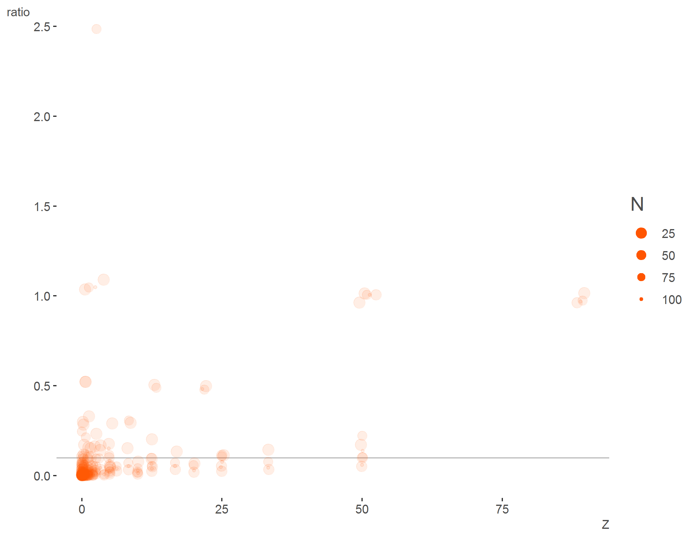

## Prior sensitivity

This is a demo related to a comment made by
[@bob-carpenter](https://github.com/bob-carpenter) on Andrew Gelman’s
blog. The gist is the following quote by Gelman:

> For each parameter (or other qoi), compare the posterior sd to the
> prior sd. If the posterior sd for any parameter (or qoi) is more than
> 0.1 times the prior sd, then print out a note: “The prior distribution
> for this parameter is informative.

The code provides a results/heatmap similar to Bob’s suggestion/initial
code/results.

[Blog
post](https://statmodeling.stat.columbia.edu/2019/08/10/for-each-parameter-or-other-qoi-compare-the-posterior-sd-to-the-prior-sd-if-the-posterior-sd-for-any-parameter-or-qoi-is-more-than-0-1-times-the-prior-sd-then-print-out-a-note-the-prior-dist/)

[Bob’s
comment](https://statmodeling.stat.columbia.edu/2019/08/10/for-each-parameter-or-other-qoi-compare-the-posterior-sd-to-the-prior-sd-if-the-posterior-sd-for-any-parameter-or-qoi-is-more-than-0-1-times-the-prior-sd-then-print-out-a-note-the-prior-dist/#comment-1099210)

As noted in the comments, there are definitely issues regarding this
approach, like any essentially arbitrary cutpoint, and the potential for
abuse is obvious. Furthermore, this is just one instance at each
setting, and the average of many more sims would ideally be conducted.
User discretion is advised. The following plot shows that there could be
notable disagreement between the posterior and prior means even if such
a cutoff is met.

